# 📚 Study Buddy

**Turn your course PDFs into notes, quizzes, and flashcards.**

Upload the PDFs for a course and generate study material scoped strictly to that material. Runs entirely on your own machine with your own AI credentials.

  

---

## Features

- 🗂️ **Courses & folders** — upload PDFs, organize them however you like, drag to reorder

  <table>
    <tr>
      <td>
              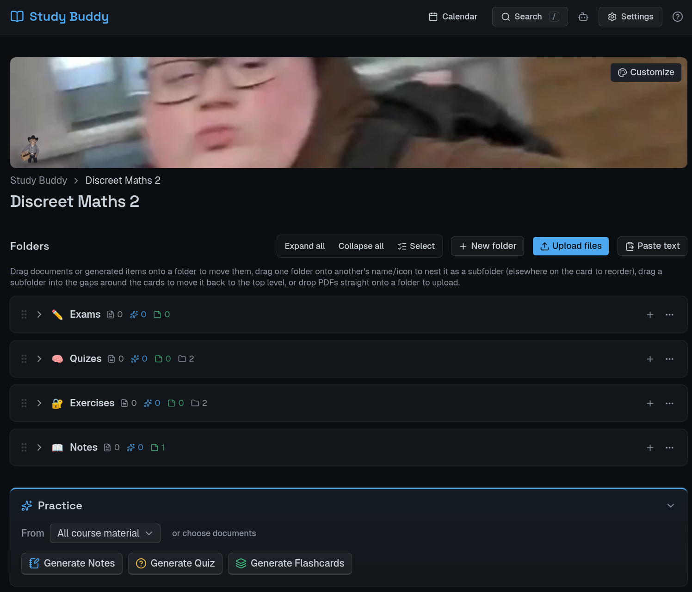
      </td>
      <td>
              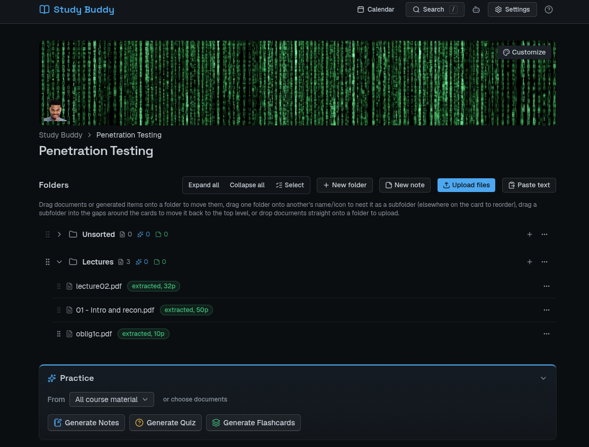
      </td>
    </tr>
  </table>

- 🔗 **Wiki-style notes** — an Obsidian-inspired editor: live-preview markdown, `[[note]]` links with backlinks, and embedded references to a PDF, generated item, or pasted image (optionally anchored to a specific line/sentence). LaTeX now renders live as you type — `$...$`/`$$...$$` conceal into real KaTeX right in the editor, not just Preview — with Overleaf-style `\command` autocomplete for fractions, sums, greek letters, and more

  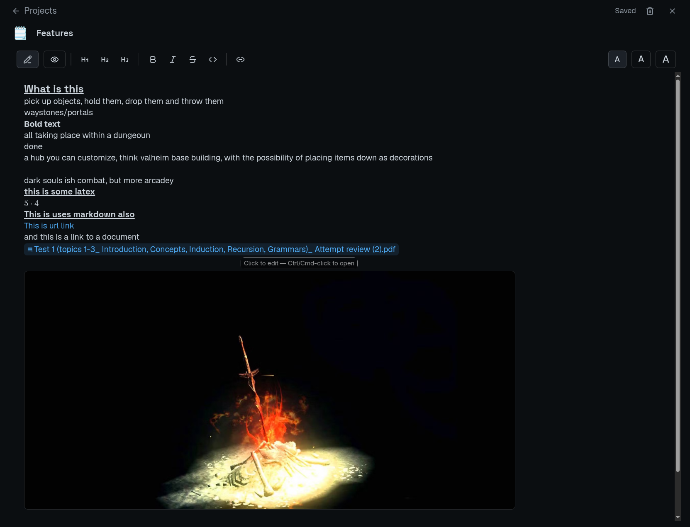

- 📝 **Notes, quizzes & flashcards** — generated from your own material, one click each; save a question-type mix (MCQ / multi-select / short answer) as a reusable quiz preset
- ✅ **Quiz grading** — MCQ graded instantly, short answers graded by AI, with a **"Retry what you got wrong"** button for fresh practice on missed concepts

  <table>
    <tr>
      <td>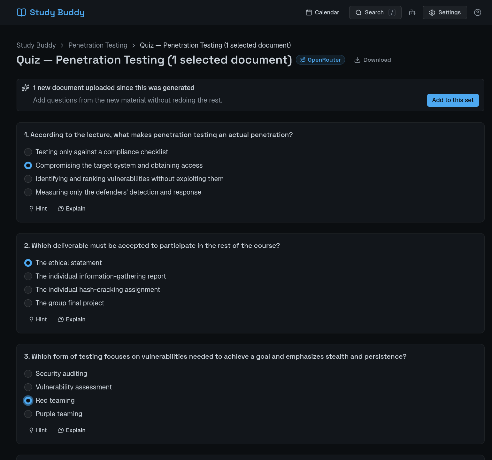</td>
      <td>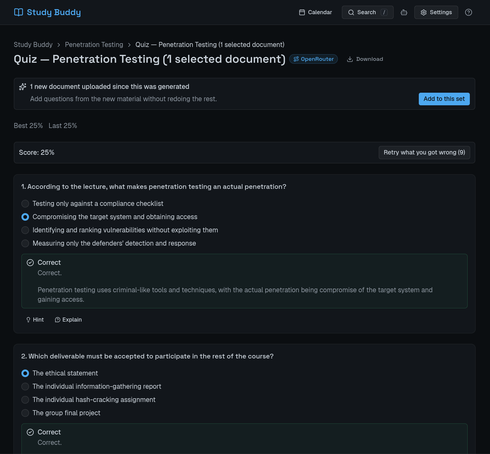</td>
    </tr>
  </table>

- 🧠 **Real spaced repetition** — flashcards only show what's actually due

  <table>
    <tr>
      <td>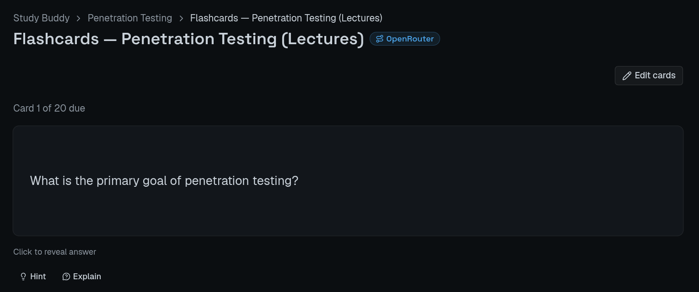</td>
      <td>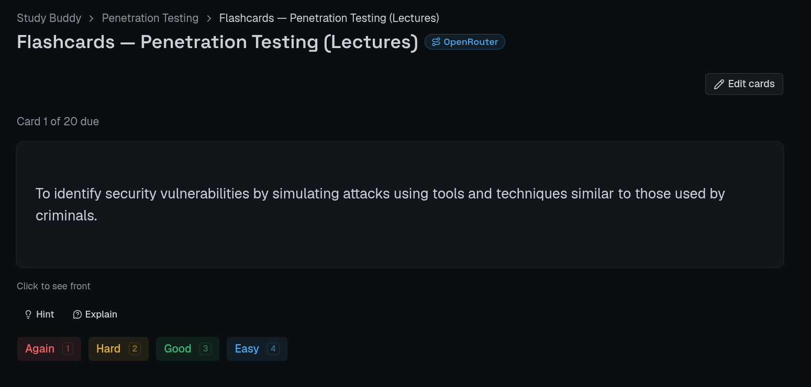</td>
    </tr>
  </table>

- 💡 **On-demand hints & explanations** — highlight anything for a hint or explanation, never spoiling an unanswered question

  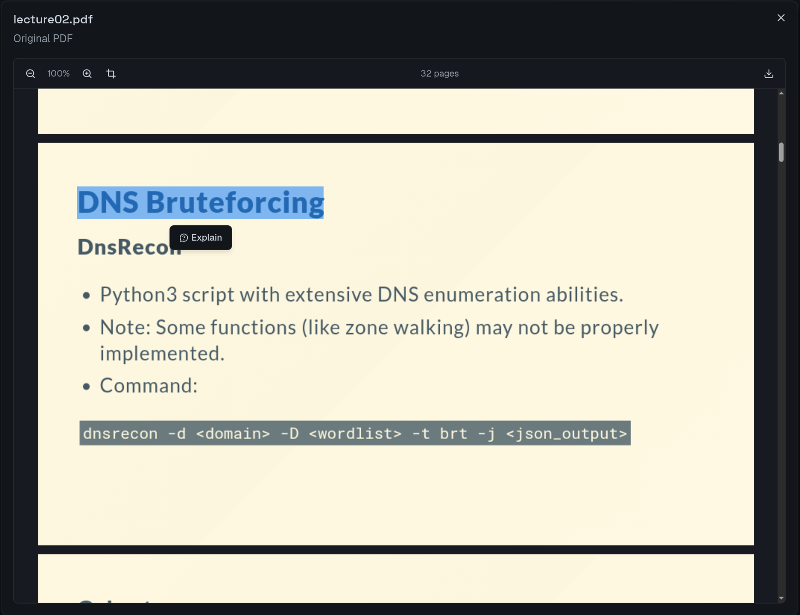

- ✂️ **Crop & Ask** — select a region of any PDF, note, or document and ask AI about just that — works everywhere Ask AI does

  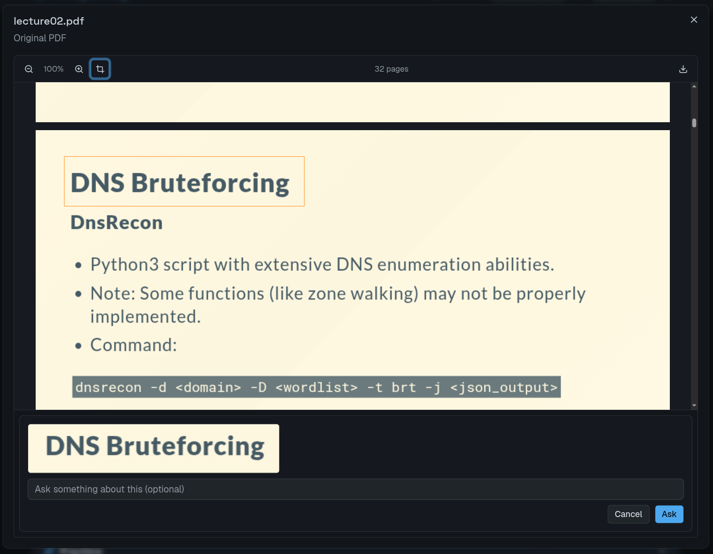

- 💬 **A general AI chat, too** — not just per-document Q&A: a persistent assistant independent of any course, with its own saved conversation history for whatever you want to ask

  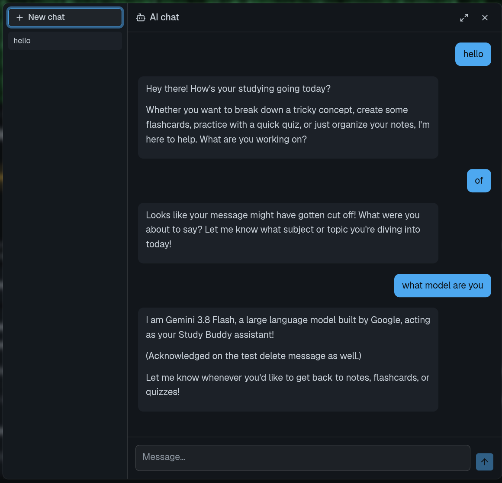

- 📋 **Paste text or images** — paste messy lecture text and hit **Make pretty** to clean it up, or paste/drop an image straight into your notes to embed it inline
- 📅 **Google Calendar & ICS feeds** — connect your own Google Calendar (read + write) and see it as a real month grid inside the app, or subscribe to a read-only ICS feed (a university portal's timetable, an LMS's assignment export) alongside it

  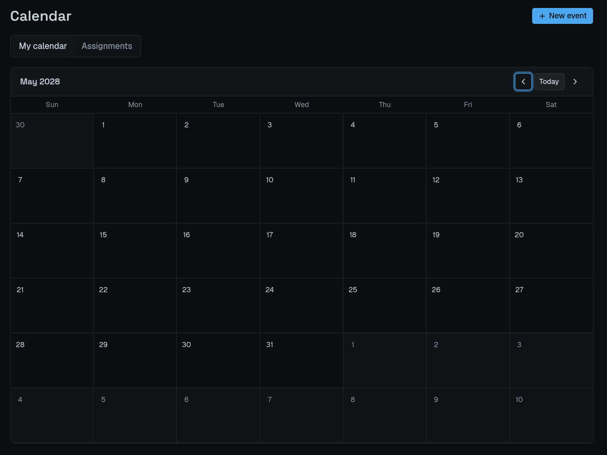
- 🔥 **Streak heatmap** — a GitHub-style view of your study activity over time
- 🧩 **Customizable home screen** — a phone-widget-style "Upcoming events" agenda alongside your streak and heatmap; toggle any of them on/off and drag to reorder in Settings

  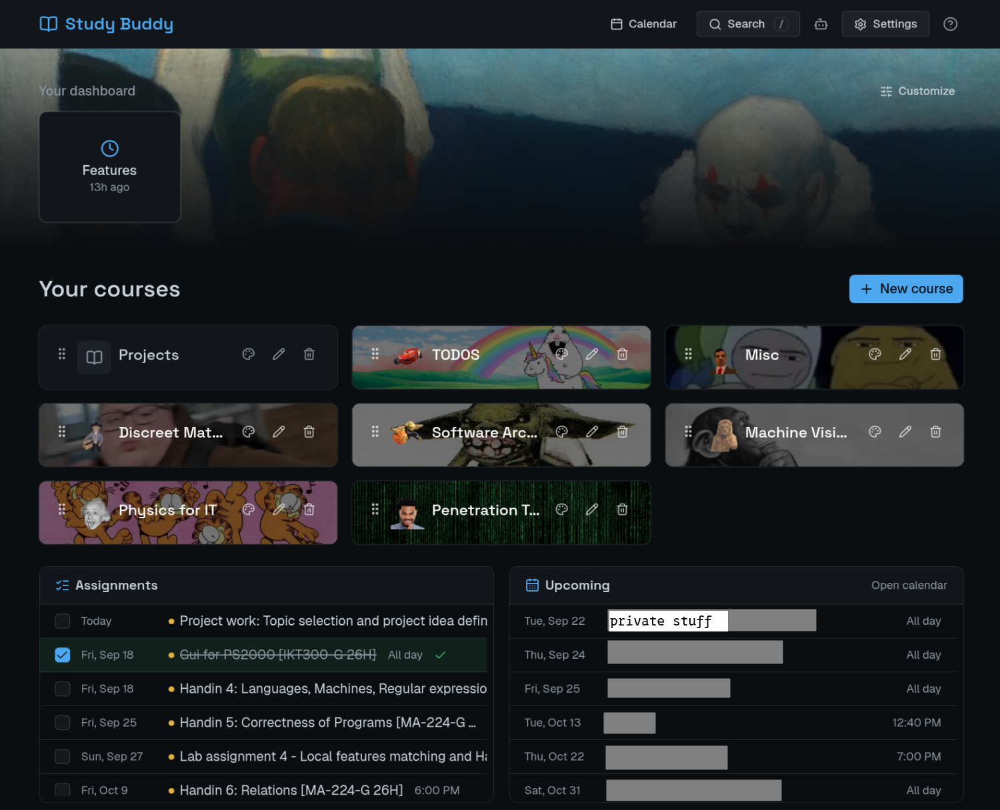

- ☁️ **Optional Supabase sync** — stays local-first by default, or point it at your own Supabase project to sync across devices
- ➕ **Supplement, don't regenerate** — add newly-uploaded PDFs to an existing quiz/deck/notes instead of starting over
- 📤 **Full data export** — download every course, note, quiz, and flashcard set — with complete review/attempt history — as one JSON file
- 🔍 **Search** — find any question, flashcard, or note across every course
- 🤖 **Bring your own AI** — Anthropic, OpenAI, or Gemini API keys; Claude Code or Codex CLI subscriptions; or a free tier via OpenRouter

  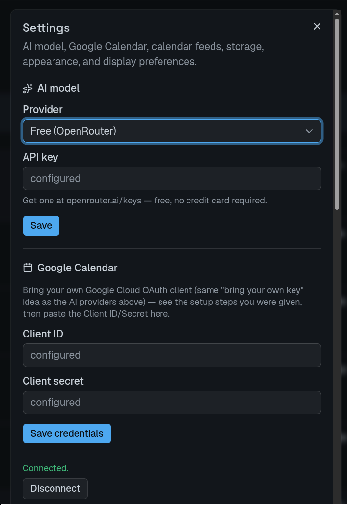

---

## Getting started

```bash
git clone https://github.com/SebastianBEllingsen/study-buddy.git
cd study-buddy
pnpm install
pnpm dev
```

Requires [Node.js](https://nodejs.org) 20+ and [pnpm](https://pnpm.io) (this repo uses `pnpm-lock.yaml` — don't install with `npm`/`yarn`, the lockfiles won't match). Open **http://localhost:3000** — a local SQLite database is created automatically under `data/` on first run and never leaves your machine.

### Connect an AI backend

Pick one from the **settings button** (⚙️) in the header — nothing generates until you do:

| Backend | What you need |
|---|---|
| **Anthropic** (API key) | [console.anthropic.com](https://console.anthropic.com) |
| **Claude Code** (subscription) | `claude` CLI installed, `claude /login` |
| **Codex CLI** (subscription) | `codex` CLI installed, `codex login` |
| **OpenAI** (API key) | [platform.openai.com/api-keys](https://platform.openai.com/api-keys) |
| **Gemini** (API key) | [aistudio.google.com/apikey](https://aistudio.google.com/apikey) — free tier |
| **Free** (OpenRouter) | [openrouter.ai/keys](https://openrouter.ai/keys) — no card needed |

Keys are stored locally, never sent anywhere except the provider you picked.

### Connect Google Calendar (optional)

Study Buddy can show and manage your real Google Calendar as a month grid inside the app. To connect it, you need your own OAuth client (free, a few minutes):

1. In the [Google Cloud Console](https://console.cloud.google.com/), create a project and enable the **Google Calendar API**.
2. Configure the OAuth consent screen, add the `.../auth/calendar` scope, and add yourself as a test user.
3. Create an **OAuth client ID** (type: Web application) with an authorized redirect URI of `http://localhost:3000/api/calendar/oauth/callback` (swap the host if you're not on the default port/domain — see `NEXT_PUBLIC_APP_URL` below).
4. Paste the generated **Client ID** and **Client secret** into the Calendar section of Settings (⚙️) in the app, then click **Connect**.

Nothing generates or connects until you do this — it's entirely optional. If you deploy the app somewhere other than `http://localhost:3000`, set `NEXT_PUBLIC_APP_URL` to that URL so the OAuth redirect matches.

Don't need write access, or just want a read-only timetable/assignments feed? Skip the OAuth setup entirely and paste an ICS feed URL into the same Calendar section of Settings instead.

### Windows: `Turbopack is not supported (win32/ia32)`

Means Node is installed as 32-bit — almost always the wrong installer on a 64-bit PC. Reinstall 64-bit Node from [nodejs.org](https://nodejs.org). If you must stay on 32-bit, run `pnpm dev:webpack` instead.

---

## How to use it

1. **Create a course**, upload PDFs into a folder, or paste text/images straight in.
2. **Generate** Notes / Quiz / Flashcards for a folder (or "All course material").
3. **Study** — quizzes grade instantly and offer a retry on what you missed; flashcards only surface what's due; select any text (or crop any region) for a Hint or Explain.
4. **Take your own notes** alongside the generated material — `[[link]]` to other notes, embed a PDF/quiz/flashcard reference, and write LaTeX that renders as you type.
5. **Added more PDFs later?** Open the existing item — a banner offers to add just the new material.
6. **Search** in the header to find anything across every course, or open the AI chat icon for a general question that isn't tied to one document.
7. **Track deadlines** on the Calendar page once Google Calendar or an ICS feed is connected.

---

## Tech stack

Next.js 16 · React 19 · TypeScript · Tailwind CSS v4 · Base UI (shadcn/ui) · SQLite (`better-sqlite3`) + optional Supabase/Postgres sync (Drizzle ORM) · Anthropic / OpenAI / Google Gen AI SDKs · Google Calendar API

## Known limitations

- No OCR — scanned/image-only PDFs are rejected with a clear message (photos can still be pasted in as embedded images, just not transcribed)
- No Anki `.apkg` export — flashcards are reviewed in-app only

## License

No license yet — all rights reserved by default. Ask first if you'd like to reuse this beyond personal use.
